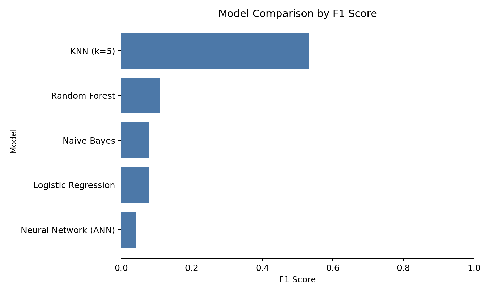
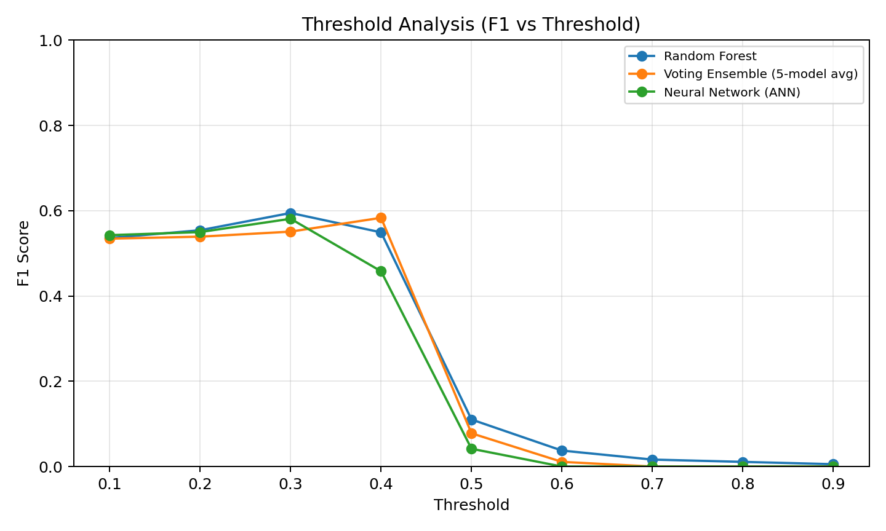
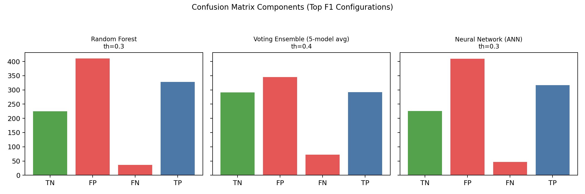

\pagenumbering{gobble}
\pagestyle{empty}

\begin{center}
\vspace*{\fill}
{\huge \textbf{Data Mining Project Report}}\\

\vspace*{\fill}
{\LARGE \textbf{Title}}\\[0.25cm]
{\Large CFPB Consumer Complaints: Predicting Monetary Relief Outcomes from Complaint-Time Information}\\

\vspace*{\fill}
{\LARGE \textbf{Names}}\\[0.25cm]
{\large Amin Ben Abdelhafidh}\\
{\large Koussay Hidouri}\\
{\large Louay Ilahi}\\

\vspace*{\fill}
{\LARGE \textbf{Course Title}}\\[0.25cm]
{\Large BA 360: Business Data Mining}\\
\vspace*{\fill}
\end{center}

\newpage
\tableofcontents
\newpage
\pagenumbering{arabic}
\pagestyle{plain}

# Dataset Description

## General Context
The dataset comes from the U.S. Consumer Financial Protection Bureau (CFPB). It contains real consumer complaints about financial products and services (for example credit cards, loans, credit reporting, and debt collection). In business terms, this dataset helps identify where customer harm occurs and where monetary relief is more likely, which supports better risk monitoring and faster case prioritization.

## Data Source

- Source: CFPB Consumer Complaint Database.
- Official page: https://www.consumerfinance.gov/data-research/consumer-complaints/
- Direct file used as full raw input in this project: data/raw/complaints.csv.
- Because the full file is very large, we created and used a memory-safe working sample for modeling: data/processed/complaints_sample.csv.

Local snapshot (as documented in the project README on 2026-04-20):

- Full raw dataset size: 14,636,145 rows and 18 columns.
- Uncompressed CSV size: about 8.0 GB.
- Compressed download size (complaints.csv.zip): about 1.7 GB.

## Unit of Observation
One observation (one row) represents one consumer complaint submitted to the CFPB complaint system. Each row includes complaint metadata available at intake time (for example product, issue, submission channel, state, and dates), and in many cases a free-text complaint narrative.

For this project, we defined a binary target from resolution information:

- 1: complaint ended with monetary relief.
- 0: complaint ended without monetary relief.

To avoid leakage, post-resolution fields are not used as predictors at inference time.

## Main Variables
Main variables used in EDA and modeling include:

- Text variable: consumer_complaint_narrative.
- Product taxonomy: product and sub_product.
- Problem taxonomy: issue and sub_issue.
- Submission and geography: submitted_via and state.
- Time variables: date_received (and derived temporal features).
- Target construction fields: company_response_to_consumer (used to derive the label, then excluded from predictor set for leakage-safe modeling).

Data handling note: because the full dataset in data/raw/complaints.csv is too large for efficient iterative experimentation on a local machine, we generated a representative sample (data/processed/complaints_sample.csv) and used that sample throughout preprocessing and model development.

# Problem Statement

## Problem to Study
State the analytical problem clearly.

## Objective
Define the objective of the analysis.

## Research Questions
List the main research questions.

## Target Variable
Explain the binary target design (monetary relief vs no monetary relief) and leakage-safe constraints.

# Data Preparation

## Missing Values
Explain handling strategy and justification.

## Outliers and Quality Checks
Describe checks and decisions.

## Feature Transformations
Detail text cleaning, vectorization, and any transformations.

## Encoding and Scaling
Document categorical encoding and scaling choices.

## Feature Selection and Leakage Control
List excluded post-resolution fields and explain why.

# Methods and Analysis

## Modeling Strategy
Explain train/test setup and model comparison approach.

## Models Implemented
- Logistic Regression (TF-IDF)
- Naive Bayes (TF-IDF)
- KNN (SVD-reduced text)
- Random Forest (structured + text)
- MLP Neural Network
- Voting Classifier Ensemble

## Why These Methods
Justify method choices for this problem.

# Results and Interpretation

## Model Comparison
Insert summary table from reports outputs.

## Threshold Analysis
Discuss trade-offs and operational threshold recommendation.

## Confusion Matrix Insights
Interpret false positives and false negatives in business terms.

## Key Findings
Provide clear, practical conclusions.

# Conclusion

## Objective Recap
Summarize initial objective.

## Methods Recap
Summarize methods used.

## Main Results
Summarize strongest findings and selected model.

## Business Insights
Summarize actionable recommendations.

# Appendix (Optional)

## Evolution and Corrections
Reference the mistakes-to-improvements timeline.

## Additional Tables
Add detailed model metrics if needed.
