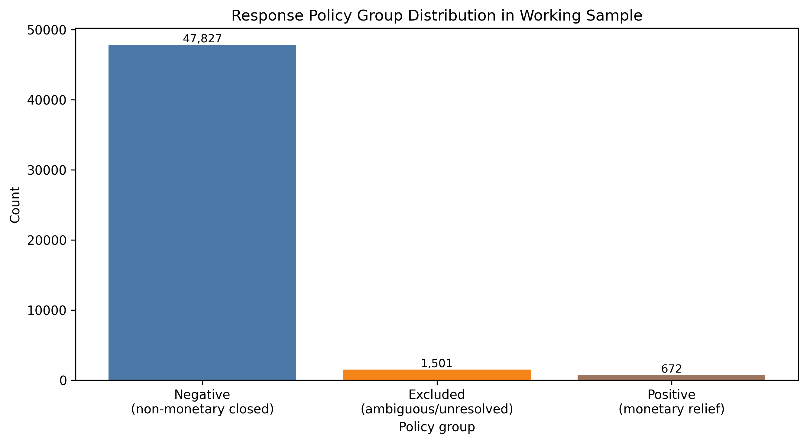
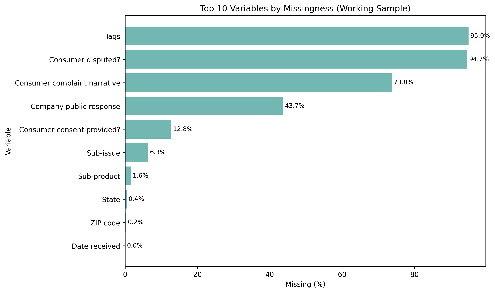
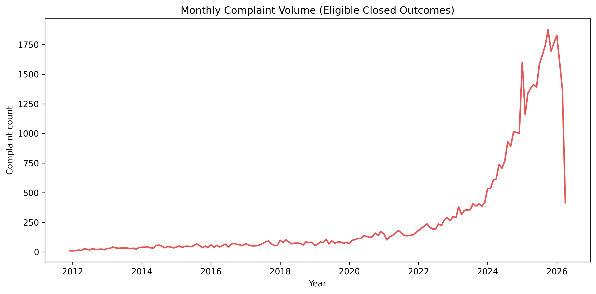

\pagenumbering{gobble}
\pagestyle{empty}

\begin{center}
\vspace*{\fill}
{\huge \textbf{Data Mining Project Report}}\\

\vspace*{\fill}
{\LARGE \textbf{Title}}\\[0.25cm]
{\Large CFPB Consumer Complaints: Predicting Monetary Relief Outcomes from Complaint-Time Information}\\

\vspace*{\fill}
{\LARGE \textbf{Names}}\\[0.25cm]
{\large Amin Ben Abdelhafidh}\\
{\large Koussay Hidouri}\\
{\large Louay Ilahi}\\

\vspace*{\fill}
{\LARGE \textbf{Course Title}}\\[0.25cm]
{\Large BA 360: Business Data Mining}\\
\vspace*{\fill}
\end{center}

\newpage
\tableofcontents
\newpage
\pagenumbering{arabic}
\pagestyle{plain}

# Dataset Description

## General Context
The dataset comes from the U.S. Consumer Financial Protection Bureau (CFPB). It contains real consumer complaints about financial products and services (for example credit cards, loans, credit reporting, and debt collection). In business terms, this dataset helps identify where customer harm occurs and where monetary relief is more likely, which supports better risk monitoring and faster case prioritization.

## Data Source

- Source: CFPB Consumer Complaint Database.
- Official page: https://www.consumerfinance.gov/data-research/consumer-complaints/
- Full raw input can be downloaded via the project helper and stored under `data/raw/` when needed for large-scale runs.
- Because the full file is very large, we created and used a memory-safe working sample for modeling: data/processed/complaints_sample.csv.

Local snapshot (as documented in the project README on 2026-04-20):

- Full raw dataset size: 14,636,145 rows and 18 columns.
- Uncompressed CSV size: about 8.0 GB.
- Compressed download size (complaints.csv.zip): about 1.7 GB.

## Unit of Observation
One observation (one row) represents one consumer complaint submitted to the CFPB complaint system. Each row includes complaint metadata available at intake time (for example product, issue, submission channel, state, and dates), and in many cases a free-text complaint narrative.

For this project, we defined a binary target from resolution information:

- 1: complaint ended with monetary relief.
- 0: complaint ended without monetary relief.

To avoid leakage, post-resolution fields are not used as predictors at inference time.

## Main Variables
Main variables used in EDA and modeling include:

- Text variable: consumer_complaint_narrative.
- Product taxonomy: product and sub_product.
- Problem taxonomy: issue and sub_issue.
- Submission and geography: submitted_via and state.
- Time variables: date_received (and derived temporal features).
- Target construction fields: company_response_to_consumer (used to derive the label, then excluded from predictor set for leakage-safe modeling).

Data handling note: because the full raw dataset is too large for efficient iterative experimentation on a local machine, we generated a representative sample (data/processed/complaints_sample.csv) and used that sample throughout preprocessing and model development.

# Problem Statement

## Problem to Study
Financial institutions and regulators receive a very large volume of consumer complaints, but only a subset of cases ends with monetary relief for the consumer. The core problem is to identify, as early as possible, which complaints are more likely to lead to monetary relief using only information available at complaint time.

This is a pressing business problem for companies because slow or inaccurate complaint triage increases regulatory exposure, operational costs, customer dissatisfaction, and reputational risk. In practice, firms must quickly decide which complaints need urgent escalation versus standard handling. A reliable predictive signal can improve response prioritization, shorten time-to-resolution for high-risk cases, and support more consistent consumer-outcome management.

## Objective
The objective of this analysis is to build and evaluate a leakage-safe binary classification model that predicts whether a CFPB complaint will end with monetary relief. We aim to compare multiple modeling approaches, assess class-imbalance-aware performance metrics, and identify a practical decision threshold for operational use.

## Research Questions
The main research questions are:

- Can complaint-time features (text narrative, product/issue categories, channel, geography, and time features) predict monetary relief outcomes with useful accuracy?
- Which model family provides the best trade-off between precision, recall, and overall robustness for this imbalanced classification task?
- How should the decision threshold be adjusted to match operational priorities, such as capturing more potential monetary-relief cases versus reducing false alarms?
- Which complaint attributes appear most informative for distinguishing likely monetary-relief outcomes?

## Target Variable
The target variable is a binary label derived from the complaint resolution outcome:

- 1: complaint ended with monetary relief.
- 0: complaint ended without monetary relief.

To preserve real-world validity, predictors are restricted to complaint-time information only. Fields that reveal or are strongly tied to post-resolution outcomes are excluded from the feature set used at inference time.

# Data Preparation

## Preparation Workflow Across Notebook 1 and Notebook 2
Data preparation was intentionally split into two stages:

- Notebook 1 (Data Loading + EDA): profile data quality, inspect missingness, and validate response-policy assumptions before modeling transformations.
- Notebook 2 (Preprocessing): implement the authoritative target-construction policy, clean and engineer features, enforce leakage boundaries, and export train/test-ready datasets.

This separation keeps exploratory diagnostics descriptive while keeping modeling inputs deterministic and reproducible.

## Stage 1: EDA-Driven Preparation Decisions (Notebook 1)
Notebook 1 established the practical constraints that informed preprocessing:

- Sample-based workflow for memory safety and faster iteration on local hardware.
- High missingness in some fields (for example `Consumer complaint narrative` at about 73.8% missing in the working sample), indicating a need for robust text-presence handling.
- Strong class imbalance in the monetary-relief outcome proxy, indicating that downstream evaluation must go beyond accuracy.
- Clear evidence that some response statuses are unresolved or ambiguous and should not be used as supervised labels.

Notebook 1 also produced preparation-oriented artifacts in `reports/`, including:

- `eda_label_policy_summary.csv`
- `eda_missingness_by_proxy.csv`
- `eda_variable_preparation_summary.csv`

These artifacts were used as input checks before final preprocessing.

## Stage 2: Authoritative Preprocessing (Notebook 2)
Notebook 2 converted EDA findings into the final supervised learning dataset.

### Target Construction and Eligibility Filter
The target was created from `Company response to consumer` using a strict policy:

- Positive class (1): `Closed with monetary relief`.
- Negative class (0): clearly closed non-monetary outcomes (`Closed with explanation`, `Closed with non-monetary relief`, `Closed without relief`, and `Closed`).
- Excluded: unresolved or ambiguous outcomes (for example `In progress`, `Untimely response`, and `Closed with relief`).

From the sampled dataset, this policy yielded:

- 48,499 rows retained for supervised modeling.
- Monetary-relief positive rate of 1.3856%.

This filter reduces label noise at the cost of sample size, which is appropriate for a high-stakes imbalanced classification task.

### Text Cleaning and Narrative Features
Complaint narratives were transformed with a deterministic cleaning function:

- lowercase normalization,
- URL removal,
- email removal,
- cleanup of repeated redaction tokens,
- whitespace normalization.

From the cleaned text, two structured features were engineered:

- `narrative_length_raw` and capped `narrative_length` (99th percentile cap = 3138.22),
- `has_narrative` indicator (binary).

The percentile cap provides robust outlier control without deleting observations.

### Temporal Feature Engineering
Date fields were parsed and transformed into complaint-time features:

- `year_received`,
- `month_received`,
- `quarter_received`,
- `days_to_send` (from `Date received` to `Date sent to company`).

Missing temporal derivatives were imputed with zero only at the numeric feature assembly stage to maintain a complete matrix.

### Categorical Encoding and Matrix Assembly
Selected categorical predictors were one-hot encoded:

- `Product`,
- `Issue`,
- `State`,
- `Submitted via`.

The final preprocessing output before model-specific text vectorization contained:

- 250 total features,
- 243 one-hot categorical columns,
- 6 numeric/engineered columns,
- 1 cleaned text field (`narrative_clean`) to be vectorized in Notebook 3.

### Missing-Value Handling
Missing-value treatment followed feature semantics:

- Text: missing narratives converted to empty strings.
- Numeric engineered fields: filled with zeros where needed for matrix completeness.
- Encoded categorical indicators: naturally represented as zeros after one-hot encoding.

In the final assembled matrix, the tracked top features report 0% missingness in preprocessing outputs.

### Leakage Control
Leakage prevention was enforced as a hard rule:

- `Company response to consumer` was used only for target construction,
- target-related fields were excluded from predictors.

Notebook 2 validation reported `predictor_leakage_columns_found = 0`, confirming no direct leakage columns in `X`.

## Exported Artifacts for Modeling
Notebook 2 exported all modeling inputs and documentation artifacts:

- `data/processed/train_features.csv`
- `data/processed/test_features.csv`
- `reports/preprocessing_summary.csv`
- `reports/feature_dictionary.csv`

The train/test split was stratified (80/20) to preserve class imbalance structure for fair downstream model comparison.

\FloatBarrier

# Methods and Analysis

## Modeling Strategy
Explain train/test setup and model comparison approach.

## Models Implemented
- Logistic Regression (TF-IDF)
- Naive Bayes (TF-IDF)
- KNN (SVD-reduced text)
- Random Forest (structured + text)
- MLP Neural Network
- Voting Classifier Ensemble

## Why These Methods
Justify method choices for this problem.

# Results and Interpretation

## Model Comparison
Insert summary table from reports outputs.

## Threshold Analysis
Discuss trade-offs and operational threshold recommendation.

## Confusion Matrix Insights
Interpret false positives and false negatives in business terms.

## Key Findings
Provide clear, practical conclusions.

# Conclusion

## Objective Recap
Summarize initial objective.

## Methods Recap
Summarize methods used.

## Main Results
Summarize strongest findings and selected model.

## Business Insights
Summarize actionable recommendations.

# Appendix (Optional)

## Evolution and Corrections
Reference the mistakes-to-improvements timeline.

## Additional Tables
Add detailed model metrics if needed.
